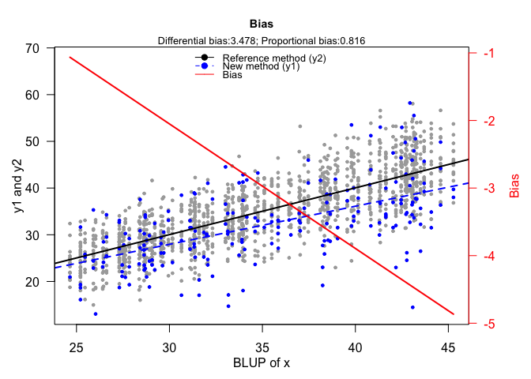

<!-- README.md is generated from README.Rmd. Please edit that file -->

# MethodCompare

<!-- badges: start -->
<!-- badges: end -->

The goal of MethodCompare is to implement the methodology reported in
the two papers : “Effective plots to assess bias and precision in method
comparison studies” (P. Taffé) published in *Statistical Methods in
Medical Research* (2018; 27:1650-1660), “Assessing bias, precision, and
agreement in method comparison studies” (P. Taffé) published in
*Statistical Methods in Medical Research* (2020; 29:778-796). The
package will generate graphs (the bias, total bias, precision,
comparison, agreement without and after recalibration, percentage of
agreement without and after recalibration, mean squared error and square
root mean squared error plots), compute the differential and
proportional biases with their respective 95% CIs.

## Installation

You can install the development version of MethodCompare from
[GitHub](https://github.com/UBERLULU/MethodCompare) with:

``` r
# install.packages("devtools")
devtools::install_github("UBERLULU/MethodCompare")
```

## Example

This is a basic example which shows you how to solve a common problem:

``` r
library(MethodCompare)
## basic example code
### Load the data
data(data1)
### Analysis
measure_model <- measure_compare(data1)
#> [1] "Computing differential and proportional biases"
#> [1] "id variable: id"
#> [1] "New method y variable: y1"
#> [1] "Reference method y variable: y2"
#> [1] "Number of simulations set to 1000"
```

``` r
### Display bias plot
bias_plot(measure_model)
#> [1] "Generating Bias Plot ..."
```


